# Anti-Rot

Chrome extension + Python backend that automatically blocks non valuable YouTube videos.

## How It Works

- You browse YouTube normally
- Extension detects when you open a video, extracts the URL
- Backend extracts the transcript using supadata
- LLM classifies: educational or distraction
- non valuable? Page gets replaced with a "Time is valuable" screen
- Valuable? Nothing happens, keep watching

**Prerequisites:** Chromium Based Browsere

## How to install

1. Clone the github repo ```git clone https://github.com/prshv1/Anti_Rot```
2. Open Google Chrome and go to:  ```chrome://extensions```
3. Enable Developer Mode (top-right toggle)
4. Drag and drop the folder named "Client Side" from the repo

## Version log
v0.1: prototype stage
v0.2: Deployed the backend on Cloud servers
v0.3: Switched from YT-DLP to supadata for transcripts in backend
v0.4: Completed the client side software, and ready for beta shipping.

## Project Structure

```mermaid
flowchart TD
    A[User opens YouTube video] --> B[Chrome Extension extracts URL]
    B --> C[Sends URL to Backend Server]
    C --> D[Supadata API fetches transcript]
    D --> E[Transcript sent to LLM via OpenRouter]
    E --> F{LLM Output}
    F -->|1 - Valuable| G[✅ Allow video]
    F -->|0 - Time Waste| H[🚫 Block video]
```


## Upcoming Features
- Custom Preferances to decide Valuable/non valuable videos
- Support for videos which aren't in english
- Hide Distracting UI elements, Like Unhook
- Support Extended to sites outside of youtube

## Skills Learned
- Creating APIs
- Deploying Docker on GCP
- Managing User Acounts
- Working With LLMs
- creating Simple and Usefull software

## Development Info
- Version: Beta 0.4
- Current Development Stage: Prototype 
- With Love, [@prshv1](https://linktr.ee/prshv1)
